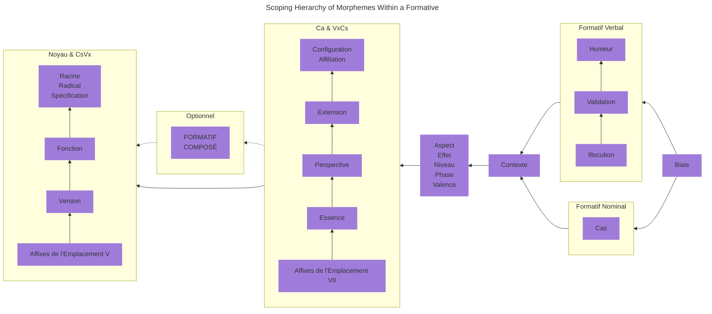

## 2.0 Morpho-Phonologie {#Sec2}

La morpho-phonologie définit la manière dont une langue utilise ses phonèmes (sons porteurs de sens) et caractéristiques phonologiques (par exemple : l'accent tonique, la gémination, le ton, etc.) pour générer les motifs composant des mots et pour appliquer des catégories morphologiques (par exemple : singulier _versus_ pluriel, temps verbal, etc.) à ces mots.

::: info Parties de la Locution

Il y a trois types de mots en Nouvel Ithkuil : les **formatifs**, les **adjoints**, et les **référentiels**. Les formatifs constituent une classe de mots qui correspondent à la fois aux noms et aux verbes dans les langages naturels (Dans la [Sec. 2.4.2](02#Sec2_4_2) ci-dessous, nous verrons pourquoi combiner les noms et les verbes en une classe unique est adéquat dans la grammaire neo-ithkuilique). Les adjoints sont des mots « d'aide » qui s'associent à un formatif pour fournir des informations sémantiques supplémentatires concernant ledit formatif. Les référentiels sont un type de mots similaires aux pronoms dans les langages naturels, bien que, comme nous le verrons, ils soient plus dynamiques et exhaustifs dans leur utilisation que la collection habituelle de pronoms présente dans d'autres langues.

:::

::: info Typologie Grammaticale

Le Nouvel Ithkuil est principalement une langue agglutinative, et secondairement une langue synthétique. Cela signifie que la formation des radicaux, inflections et dérivations morpho-sémantiques, et la combinaison de ces éléments en mots porteurs de sens, se fait d'abord par la jointure d'une ou plusieurs affixes (dont des préfixes, suffixes et infixes) à une racine sémantique. De plus, ces affixes sont elles-mêmes hautement synthétiques, et combinent de nombreuses catégories morphologiques en une unique forme phonologique. Pour résumer, cela signifie que les mots en Nouvel Ithkuil sont formés en joignant plusieurs affixes à une racine fondamentale, chaque affixe pouvant contenir plusieurs éléments de sens.

:::

## 2.1 La Séquence Standard des Formes Vocaliques {#Sec2_1}

Durant notre examen de la structure des mots en Nouvel Ithkuil, nous verrons que celle-ci est déterminée par une série d'« emplacements », chacun d'eux pouvant accueillir une affixe. Nous verrons ensuite qu'une bonne partie des affixes utilisables dans ces emplacements s'appuient sur un motif récurrent de neuf voyelles, ou sur une matrice de valeurs dont un axe contient neuf formes vocaliques. Par conséquent, la langue emploie une séquence standard généralisée de neuf formes vocaliques en plusieurs séries, qui peut être utilisée pour remplir chacun des Emplacements. Cette séquence standard généralisée de voyelles facilite la mémorisation de la myriade d'affixes pour des personnes souhaitant réellement apprendre la langue.

Le tableau ci-dessous affiche les différentes séries de cette « Séquence Standard des Formes Vocaliques ». Les lecteurs pourront se référer à ce tableau durant l'examen des nombreux emplacements morphologiques utilisés pour la formation des mots en Nouvel Ithkuil. Malgré le nombre de formes vocaliques, la structure de la séquence est relativement systématique lorsqu'elle est examinée de près.

    <table>
        <caption>La Séquence Standard des Formes Vocaliques</caption>
        <thead>
            <tr>
                <th>Forme</th>
                <th>Série 1</th>
                <th>Série 2</th>
                <th>Série 3&#42;</th>
                <th>Série 4</th>
            </tr>
        </thead>
        <tbody>
            <tr>
                <th>1</th>
                <td>a</td>
                <td>ai</td>
                <td>ia / uä</td>
                <td>ao</td>
            </tr>
            <tr>
                <th>2</th>
                <td>ä</td>
                <td>au</td>
                <td>ie / uë</td>
                <td>aö</td>
            </tr>
            <tr>
                <th>3</th>
                <td>e</td>
                <td>ei</td>
                <td>io / üä</td>
                <td>eo</td>
            </tr>
            <tr>
                <th>4</th>
                <td>i</td>
                <td>eu</td>
                <td>iö / üë</td>
                <td>eö</td>
            </tr>
            <tr>
                <th>5</th>
                <td>ëi</td>
                <td>ëu</td>
                <td>eë</td>
                <td>oë</td>
            </tr>
            <tr>
                <th>6</th>
                <td>ö</td>
                <td>ou</td>
                <td>uö / öë</td>
                <td>öe</td>
            </tr>
            <tr>
                <th>7</th>
                <td>o</td>
                <td>oi</td>
                <td>uo / öä</td>
                <td>oe</td>
            </tr>
            <tr>
                <th>8</th>
                <td>ü</td>
                <td>iu</td>
                <td>ue / ië</td>
                <td>öa</td>
            </tr>
            <tr>
                <th>9</th>
                <td>u</td>
                <td>ui</td>
                <td>ua / iä</td>
                <td>oa</td>
            </tr>
        </tbody>
    </table>

\* Lorsqu'elles sont précédées par **y**-, les formes de la Série 3 commençant par -**i** deviennent leur forme alternative (par exemple : **yuä**, pas **yia**), alors que les formes de la Série 3 commençant par -**u** deviennent leur forme alternative lorsqu'elles sont précédées par **w**- (par exemple : **wiä**, pas **wua**).

## 2.2 Règles pour l'Insertion d'un Coup de Glotte dans une Forme Vocalique {#Sec2_2}

Durant notre examen de la structure des mots, nous verrons que certains des emplacements morpho-phonologiques la constituant demandent l'insertion d'un coup de glotte dans une forme vocalique **V**. Pour ce faire, suivez les règles suivantes :

1. Si **V** est une voyelle seule ou une diphtongue, le coup de glotte est placé après **V**. Par exemple : -**a** devient -**a’**, -**ai** devient -**ai’**.
2. Si **V** est une conjonction disyllabique, le coup de glotte est inséré entre les deux voyelles de **V**. Par exemple : -**ua** devient -**u’a**.
3. Lors de l'application de la Règle 1 ci-dessus, si l'insertion cause l'apparition d'une conjonction phonotactiquement interdite ou euphoniquement déplaisante, ou si le coup de glotte est inséré en fin de mot, alors une voyelle epenthétique doit être ajoutée comme suit :
	* Si **V** est une voyelle seule, elle est dupliquée à la suite du coup de glotte ; Par exemple : -**a** devient -**a’a**.
	* Si **V** est une diphtongue, le coup de glotte est inséré entre les deux voyelles de la diphtongue (en exception à la Règle 1 ci-dessus) ; Par exemple : -**ai** devient -**a’i** au lieu de l'habituel -**ai’**.
4. Le [Cas Exceptionnel dans Sec. 4.6](04#Sec4_6) expliquera comment, dans certaines circonstances, un coup de glotte dans l'affixe `Vc` de l'Emplacement IX peut être décalé sur un autre Emplacement du mot, dans le but d'en réduire le nombre de syllabes.

## 2.3 La Structure des Formatifs {#Sec2_3}

La structure morphologique d'un formatif peut être définie par la formule suivante :

::: center

<code>(Cc + Vv) + Cr + Vr + ( CsVx ... ) + Ca + ( VxCs ... ) + ( VnCn ) + Vc / Vk + [ACCENT]</code>

:::

Où, à l'exception de `Cr` et de `[ACCENT]`, chaque terme fait référence à une affixe composée soit d'une forme consonantique (représentées par **C** dans la formule), soit d'une forme vocalique (représentées par **V**), soit d'une combinaison des deux (par exemple : <code>CsVx</code> ou <code>VnCn</code>). Le terme `Cr` fait référence à la racine du mot elle-même, une forme consonantique constituée d'une à cinq consonnes. Comme le montrent les ensembles entre parenthèses, certains des termes de cette formule sont optionnels ; Ainsi, certains formatifs contiennent un minimum de cinq termes : <code>Cr + Vr + Ca + Vc / Vk + [ACCENT]</code>. Ces divers éléments morphologiques doivent apparaître dans un ordre donné, et peuvent donc être compris comme remplissant dix « emplacements » morphologiques. Ces Emplacements sont numérotés séquentiellement de I à X, comme illustré dans le tableau suivant.

<!-- @include: struct.md{1-156} -->

Les structures morphologiques et fonctions sémantiques spécifiques à chacun de ces emplacements seront abordées séparément dans des sections dédiées de ce document. Un aperçu préliminaire de chaque emplacement est déroulé ci-dessous.

::: tabs

@tab I

`Cc`

Cet emplacement peut être rempli par un coup de glotte **’**-, **h**-, ou une form biconsonantique commençant par **h**- (par exemple : **hw**-, **hr**-, **hm**-, etc.). Il indique si le formatif est indépendant (non composé), composé de Type 1 ou composé de Type 2. La composition de formatifs est abordée dans la [Sec. 10.1](10#Sec10_1). Il indique aussi si l'Emplacement II ci-dessous contient le « raccourci » des Emplacements IV et VI (permettant que ceux-ci soient élidés, raccourcissant le mot).

@tab II

`Vv`

Contient l'une des 32 formes vocaliques différentes indiquant le Radical et la Version du formatif. Chaque racine possède quatre radicaux associés ; Les radicaux sont abordés dans la [Sec. 2.4.3](02#Sec2_4_3). Chaque formatif possède deux Versions, PROCESSUELLE et COMPLÉTIVE, qui sont abordées dans la [Sec. 3.7](03#Sec3_7). Additionnellement, cet emplacement peut contenir un « raccourci » pour les Emplacements IV et VI (permettant que ceux-ci soient élidés, raccourcissant le mot). Dans certaines circonstances, cet emplacement fonctionne également comme un « raccourci » pour l'une de trois affixes pré-sélectionnées de l'Emplacement VII.

@tab III

`Cr`

C'est une forme consonantique composée d'une à cinq consonnes, indiquant la racine sémantique du formatif, abordée dans la [Sec. 2.4](02#Sec2_4).

@tab IV

`Vr`

Contient l'une des 32 formes vocaliques indiquant la Fonction, la Spécification et le Contexte du formatif. Il existe deux Fonctions : STATIVE et DYNAMIQUE, abordées dans la [Sec. 3.8](03#Sec3_8). Il existe quatre Spécifications : BASIQUE, CONTENTIELLE, CONSTITUTIVE et OBJECTIVE, abordées dans la [Sec. 2.4.4](02#Sec2_4_4). Il existe quatre Contextes : EXISTENTIEL, FONCTIONNEL, REPRESENTATIONNEL et AMALGAMATIF, abordés dans la [Sec. 3.9](03#Sec3_9).

@tab V

(`CsVx` ... )

Contient une ou plusieurs affixes descriptives de la forme « forme consonantique + forme vocalique » qui s'appliquent au radical seul (plutôt qu'au mot dans sont ensemble). Chaque affixe peut avoir trois types : circonstanciel, dérivationnel, ou limité. Plus de 400 affixes de ce type sont disponibles, et elles sont abordées dans le [Chapitre 7](07).

@tab VI

`Ca`

Une affixe consonantique conjonctive couvrant les cinq catégories suivantes : la Configuration, l'Affiliation, l'Extension, la Perspective et l'Essence. Ces catégories sont toutes abordées dans le [Chapitre 3](03). La formation du complexe affixal <code>Ca</code> lui-même est abordée dans la [Sec. 3.6](03#Sec3_6).

@tab VII

`VxCs`

Contient une ou plusieurs affixes descriptives de la forme « forme vocalique + forme consonantique » qui s'appliquent à la combinaison du radical et de ses catégories d'Emplacement VI <abbr>Ca</abbr> (plutôt qu'au radical seul). Mise à part l'inversion des formes consonantique et vocalique, ce sont les mêmes affixes qui sont utilisées pour l'Emplacement V.

@tab VIII

`VnCn`

Une affixe de type « forme vocalique + forme consonantique » qui exprime l'Humeur ou la Portée de Cas, ainsi que l'Aspect, la Phase, le Niveau ou l'Effet. L'explication de toutes ces catégories est le sujet du [Chapitre 5](05).

@tab IX

`Vc` / `Vf` / `Vk`

Une affixe vocalique qui, selon l'accentuation tonique indiquée par l'Emplacement X, exprime soit le Cas du formatif, soit le Format du formatif, soit une combinaison des catégories d'Illocution et de Validation. Le Cas est abordé dans le [Chapitre 4](04) ; Le Format dans la [Sec. 10.1](10#Sec10_1), et l'Illocution et la Validation dans le [Chaptire 6](06).

@tab X

`[ACCENT]`

L'accentuation syllabique du mot détermine le type de l'affixe exprimée dans l'Emplacement IX. Ceci est abordé dans la [Sec. 6.2.1](06#Sec6_2_1).

:::

### Hiérarchie des Domaines de Morphèmes au Sein d'un Formatif

La structure des Emplacements du formatif reflète plus ou moins la hiérarchie des morphèmes en son sein, c'est-à-dire l'ordre dans lequel l'information sémantique de chaque morphème est prise en compte et ajoutée à la morphologie construite à mesure que le mot est déroulé, en locution ou à l'écrit. Cet ordre hiérarchique est décrit ci-dessous :

Avant d'analyser individuellement et en détail chaque Emplacement de la formule morphologique précédente, il est important de comprendre le fonctionnement de la racine et du radical de chaque formatif. Il s'agit du sujet de la prochaine section ci-dessous.

## 2.4 Racine et Formation du Radical {#Sec2_4}

Tous les mots en <ins>Nouvel</ins> Ithkuil qui sont traduisibles en français par des noms ou des verbes sont fondés autour d'un radical, qui dérive à son tour d'une racine sémantiquement abstraite. Ce procédé est expliqué dans les sections suivantes.

<!-- @include: struct.md{157-312} -->

### 2.4.1 La Racine {#Sec2_4_1}

The root forms the semantic basis from which actual noun/verb stems are derived. The root consists of a consonantal form, `Cr`, which occupies Slot III in the above morphological formula. It comprises one to five consonants (e.g., -**k**-, -**st**-, -**ntr**-, -**pstw**-, -**rmzgl**-). The phonotactic constraints (see [Sec. 1.5](01#Sec1_5)) of the language allow for over 33,000 possible roots.

The root is the basic semantic unit. For example, the root -**DN**- is a root whose semantic referent is ‘NAME/DESIGNATION/LABEL’. Functional word-stems (or simply stems) are generated from the root via instantiation of the `Vv`- vocalic affix in Slot II, as described in Sec. 2.4.3 below. However, before we can discuss Stems, it is necessary to first understand the notion of the “formative”, so that readers will understand why all stems in the language function equally as both nouns and verbs, and have both nominal and verbal meanings.

### 2.4.2 The Notion of the “Formative” {#Sec2_4_2}

The grammatical parts of speech known in other languages as nouns and verbs are combined in New Ithkuil into a single part of speech termed the formative. All formatives, without exception, can function as both nouns or verbs, and the distinction as to whether a formative is to be interpreted as a noun or a verb is made by analyzing its morpho-phonological structure and morpho-syntactic relationship to the rest of the sentence. Consequently, there are no formatives that refer only to nouns or only to verbs as in Western languages. So, for example, the first stem of the root -**DN**- mentioned above means both ‘a name’ and ‘to name’ with neither meaning being seen as more intrinsic nor fundamental nor derived from the other. Such hierarchies of nominal over verbal meaning (or vice-versa) arise only when translating to English or other Western languages, where such nominal versus verbal lexical constraints are inherent.

The reason why nouns and verbs can function as morphological derivatives of a single part of speech is because New Ithkuil morpho-semantics do not see nouns and verbs as being cognitively distinct from one another, but rather as complementary manifestations of an idea existing in a common underlying semantic continuum whose components are space and time. As in physics, the holistic continuum containing these two components can be thought of as spacetime. It is in this continuum of spacetime that New Ithkuil instantiates semantic ideas into lexical roots, giving rise to the part of speech termed the formative. The speaker then chooses to either *spatially “reify”* this formative into an object or entity (i.e., a noun) or to *temporally “activize”* it into an act, event, or state (i.e., a verb). This complementary process can be diagrammed as follows:

 {.inverted}

### 2.4.3 Stems {#Sec2_4_3}

Each root has three stems, shown by the vowel-form `Vv` in Slot II of the morphological formula in [Sec. 2.3](#Sec2_3) above. It is at the level of stem that roots become actual words with instantiated meaning. For example, the first stem of our root -**DN**- would be -**adn**-, meaning “(to be) a name [plus the entity named]; [for something/someone] to be named/called something”. The second stem of this root would be -**edn**-, meaning “(to be) a designation or reference [plus the entity so designated]; [for an entity] to (be) refer(ed) to as”, and the third stem of the root would be -**udn**-, meaning “(to be) a label [plus the entity so labeled]; [for an entity] to (be) label(ed) as”.

In addition to these three stems shown by the Slot II vowel-forms -**a**-, -**e**-, and -**u**-, there is a fourth form shown by the Slot II vowel-form -**o**-, known as “Stem Zero”. This stem-form is specialized and refers to the “stemless” overall conceptual meaning of the raw root, irrespective of a particular stem, the particular meaning being pragmatically determined based on the root itself. So, for root -**DN**-, the Stem Zero form -**odn**- would essentially be an amalgamation of the three stem meanings, thus “(to be) what something is (to be) called/referred to as or labelled [plus the entity called/labeled/referred to as such]”. This allows for a speaker to use stems to create a deliberate semantic ambiguity when they do not wish to make a distinction between, say, an adult human and a human child.

### 2.4.4 Specification {#Sec2_4_4}

To further distinguish the basic semantic idea of a word, there is an additional morphological category termed **Specification**. Each of the three stems, as well as the fourth “Stem Zero” form, has four Specifications. These Specifications serve to indicate how the stem is to be interpreted semantically within the context of the rest of the sentence. This is best explained by describing the purpose of each Specification individually below, along with examples. The four Specifications are BASIC, CONTENTIAL, CONSTITUTIVE, and OBJECTIVE.

::: tabs

@tab BSC

<dl>
    <dt>BASIC</dt>
    <dd>A holistic instantiation of a stem, prior to the application of one of the other three Specifications,
        essentially encompassing the meanings of the <abbr>CTE</abbr> and <abbr>CSV</abbr> specifications below. For roots representing naturally
        “activized”, “time-unstable”, dynamic, or psychologically verb-like notions, the BASIC nominal formative would
        mean “an instance/occurrence of X”, while the BASIC verbal formative would mean “(an instance/occurrence of)
        X(-ing) happens”. For stems representing naturally “reified”, “time-stable”, stative, or psychologically
        noun-like notions, the BASIC nominal formative would mean “an X (being present)” or for “non-count” entities,
        “an (unspecified/certain) amount/volume of X”, whereas the BASIC verbal formative would carry a STATIVE
        interpretation meaning “(an) X be present” / “[there] be (an) X”; the expansion of this meaning verbally would
        be accomplished using other Specifications.</dd>
</dl>

@tab CTE

<dl>
    <dt>CONTENTIAL</dt>
    <dd>This specification complements the <abbr>CSV</abbr> specification below. The physical or non-physical “content” or essence or
        purposeful function or idealized/abstract/platonic form thereof, as opposed to its mere physical form/shape,
        e.g., <em>the content of a piece of art</em> [what it represents or is an image/statue of]; <em>the water within
            a river</em> [regardless of its channel or course]; <em>the communicative content of a message</em>
        [regardless of the means/medium by which it is conveyed]; <em>something (made of/in) iron</em> [its form/shape
        as opposed to merely being an example of the substance]; <em>a room as a functional/habitable space, established
            by its socially communicated purpose or discernible by its design, furnishings, decor, etc.</em></dd>
</dl>

@tab CSV

<dl>
    <dt>CONSTITUTIVE</dt>
    <dd>This Specification indicates the form (physical or non-physical) in which an entity/state/act actually expresses
        itself, is shaped, or is realized, as opposed to its functional/purposeful content, i.e., "what constitutes X",
        e.g., <em>a work of art</em> [as constituted by it being a painted canvas, sculpted marble, etc., irrespective
        of what the image is or what/who the statue is of]; <em>the course of a river</em>; <em>the form/medium
            (written, spoken, recorded, etc.) of a message</em> [irrespective of what it communicates], <em>something
            iron</em> (focus on it being of a particular material/substance regardless of its form/shape), <em>a room as
            a contained volume of space established by conjoined walls and ceiling</em> [regardless of its purpose,
        dimensions, layout, design, furnishings, or decor].</dd>
</dl>

@tab OBJ

<dl>
    <dt>OBJECTIVE</dt>
    <dd>This Specification indicates whichever of the following is most salient to the semantics of the particular stem:
        (1) the tangible tool/instrument/means by which a state act/state/event occurs, or if inapplicable, then (2) the
        third-party object/entity associated with the interaction between two parties (e.g., the object being given in a
        dative interaction), or if inapplicable then (3) the resulting tangible object/product/situation, or if
        inapplicable, then (4) the semantic patient or experiencer of the state/act/event. E.g., <em>the musical
            instrument being played during a live musical performance</em>, <em>the book containing a story being read,
            an object being given to someone</em>, <em>what an artist creates (i.e., a work of art)</em>, <em>the
            entity/person/institution that forms the object/source of one’s belief</em>, <em>the resulting measurement
            from an act of measuring</em>.</dd>
</dl>

:::

The category of Specification is shown by the vocalic affix `Vr` in Slot IV of the formative (as shown in [Sec. 2.3](#Sec2_3) above). The default affixes for the four Specifications are <abbr>BSC</abbr> = -**a**-, <abbr>CTE</abbr> = -**ä**-, <abbr>CSV</abbr> = -**e**-, and <abbr>OBJ</abbr> = -**i**-.

Thus, to illustrate how Specification operates with the three stems of a root, we can break down the meanings of the three stems for our example root -**DN**- for each of the four Specifications, as follows:

::: tabs

@tab -DN-

-**DN**- <tooltip label="NAME / DESIGNATION / LABEL">NAME / DESIGNATION / LABEL</tooltip>

    
Stem 1

    

        <dl>
            <dt><abbr>BSC</abbr>: -adna-</dt>
            <dd>(to be) a name [plus the entity named]; to be named/called something</dd>
        </dl>
        <dl>
            <dt><abbr>CTE</abbr>: -adnä-</dt>
            <dd>(to be) an entity having a name</dd>
        </dl>
        <dl>
            <dt><abbr>CSV</abbr>: -adne-</dt>
            <dd>(to have) a name; to bear a name</dd>
        </dl>
        <dl>
            <dt><abbr>OBJ</abbr>: -adni-</dt>
            <dd>(to be) the name that an entity has</dd>
        </dl>
    

    
Stem 2

    

        <dl>
            <dt><abbr>BSC</abbr>: -edna-</dt>
            <dd>(to be) a designation or reference [plus the entity so designated]; to refer to as</dd>
        </dl>
        <dl>
            <dt><abbr>CTE</abbr>: -ednä-</dt>
            <dd>(to be) an entity having a designation or reference</dd>
        </dl>
        <dl>
            <dt><abbr>CSV</abbr>: -edne-</dt>
            <dd>(to have) a designation or reference; to bear a designation or reference</dd>
        </dl>
        <dl>
            <dt><abbr>OBJ</abbr>: -edni-</dt>
            <dd>(to be) the designation or reference that an entity has</dd>
        </dl>
    

    
Stem 3

    

        <dl>
            <dt><abbr>BSC</abbr>: -udna-</dt>
            <dd>(to be) a label [plus the entity so labeled]; to label as</dd>
        </dl>
        <dl>
            <dt><abbr>CTE</abbr>: -udnä-</dt>
            <dd>(to be) an entity having a label</dd>
        </dl>
        <dl>
            <dt><abbr>CSV</abbr>: -udne-</dt>
            <dd>(to have) a label; to bear a label</dd>
        </dl>
        <dl>
            <dt><abbr>OBJ</abbr>: -udni-</dt>
            <dd>(to be) the label that an entity has</dd>
        </dl>
    

The “Stem Zero” forms would be -**odna**-, -**odnä**-, -**odne**-, and -**odni**-.

@tab -LK-

-**LK**- <tooltip label="MUSIC/ PLAY MUSIC / COMPOSE MUSIC">MUSIC/ PLAY MUSIC / COMPOSE MUSIC</tooltip>

    
Stem 1

    

        <dl>
            <dt><abbr>BSC</abbr>: -alka-</dt>
            <dd>(to be) a state/act of music playing (whether recorded or live)</dd>
        </dl>
        <dl>
            <dt><abbr>CTE</abbr>: -alkä-</dt>
            <dd>(to be) the state of there being music to be heard (playing)</dd>
        </dl>
        <dl>
            <dt><abbr>CSV</abbr>: -alke-</dt>
            <dd>(to be) a state/act of hearing/listening to music</dd>
        </dl>
        <dl>
            <dt><abbr>OBJ</abbr>: -alki-</dt>
            <dd>(to be) the sound of music, the particular (piece of) music being heard</dd>
        </dl>
    

    
Stem 2

    

        <dl>
            <dt><abbr>BSC</abbr>: -elka-</dt>
            <dd>(to be) a state/act of playing/making music (i.e., on a musical instrument)</dd>
        </dl>
        <dl>
            <dt><abbr>CTE</abbr>: -elkä-</dt>
            <dd>(to be) the state of music being made by the playing of a musical instrument</dd>
        </dl>
        <dl>
            <dt><abbr>CSV</abbr>: -elke-</dt>
            <dd>(to be) an act of playing music on a musical instrument; to (be) play(ing) a musical instrument</dd>
        </dl>
        <dl>
            <dt><abbr>OBJ</abbr>: -elki-</dt>
            <dd>(to be) a particular musical instrument (used to play music)</dd>
        </dl>
    

    
Stem 3

    

        <dl>
            <dt><abbr>BSC</abbr>: -ulka-</dt>
            <dd>(to be) a state/act of composing a passage of music, a musical phrase, a melody, a tune; to compose a
                melody/tune/musical phrase or passage</dd>
        </dl>
        <dl>
            <dt><abbr>CTE</abbr>: -ulkä-</dt>
            <dd>(to be) the state of there being a musical phrase/passage/tune or melody in one’s mind; to be a
                melody/tune/musical phrase or passage one hears in one’s mind when composing</dd>
        </dl>
        <dl>
            <dt><abbr>CSV</abbr>: -ulke-</dt>
            <dd>(to be) a state/act of composing music; to compose (a passage/piece) of music</dd>
        </dl>
        <dl>
            <dt><abbr>OBJ</abbr>: -ulki-</dt>
            <dd>(to be) the particular melody/tune/musical phrase or passage being composed or played from one’s mind
            </dd>
        </dl>
    

The “Stem Zero” forms would be -**olka**-, -**olkä**-, -**olke**-, and -**olki**-.

:::

### 2.4.5 The Lexicon {#Sec2_4_5}

The Roots and Stems of the language (plus their Specifications) are listed in a separate [Lexicon](http://ithkuil.net/newithkuil_lexicon.pdf) document.

::: tip

Please consult [the computerized database](14) as your primary reference, as it offers rectifications and supplementary information for the errors found in the original document.

:::

<PDF url="../assets/newithkuil_lexicon.pdf" />

## 2.5 Adjuncts {#Sec2_5}

Besides formatives, another part of speech in New Ithkuil is the **adjunct**. Adjuncts are so named because they operate in conjunction with adjacent formatives to provide additional grammatical information about the formative, somewhat like auxiliary verbs in English (e.g., “may, will, would, do, have”) or like noun determiners (e.g., “the, this, those”). Adjuncts are formed from one or more consonantal and/or vocalic affixes, combined agglutinatively. There are several different types of adjuncts, described in detail in [Chapter 8](08).

## 2.6 Referentials {#Sec2_6}

Referentials are words that operate similarly to pronouns in natural languages, identifying the personal referent associated with a formative. The structure and operation of referentials, however, is more complex and dynamic than the pronouns of natural languages. Referentials will be discussed in [Chapter 9](09).

## 2.7 A Self-Segregating Morphology {#Sec2_7}

The language employs a pitch accent system as the means by which word boundaries may be parsed. The details of this pitch accent system are given below:

1. All unstressed syllables of a word prior to the stressed syllable carry neutral (MID-toned) pitch. Beginning with the stressed syllable, the remainder of the word must carry a single non-MID pitch contour, as described in Rule 2 below.

2. Beginning with the stressed syllable of the word, a word may carry ANY of the following pitch contours at the speaker’s discretion: FALLING, HIGH, RISING-FALLING, FALLING-RISING. Additional pitch contours may be used in the following circumstances:

    * If the sentence carries VERIFICATIVE Illocution (equivalent to a yes/no question), the speaker may optionally utilize RISING pitch on the last word of the interrogative clause.
    * For clauses with non-NARRATIVE Register, the first and last word of the register clause may optionally be marked by LOW tone (in which case it is not necessary to utilize the end-register adjunct).

In general, the choice of pitch may match what the speaker is naturally comfortable with using from their own native language, subject to these rules.

3. Once a pitch has been chosen for the stressed syllable, it must be pronounced continuously through to the end of the word without change to a different contour (i.e., each word will have only one non-MID pitch contour).

4. If a word carries word-initial stress (i.e., it does not begin with neutral MID pitch) or is monosyllabic, and is not at the beginning of a breath group, then it must carry a pitch whose initial tone is different from the final tone of the previous word, so that two identical tones are not juxtaposed at the boundary between two words. In practice, this means the following rules apply between two adjacent words within the same breath group (i.e., they are not separated from each other by a pause in speech), where the second word carries word-initial stress or is monosyllabic:

    * When preceded by a word with either FALLING, RISING-FALLING, or LOW pitch, a monosyllabic word or word with word-initial stress must have either FALLING, FALLING-RISING, or HIGH pitch.
    * When preceded by a word with either HIGH, RISING, or FALLING-RISING pitch, a monosyllabic word or word with word-initial stress must have either RISING, RISING-FALLING, or LOW pitch.

5. In unusual situations (e.g., singing a song) when pitch-accent is unavailable or undesirable as a means of parsing word boundaries and the placement of pauses between words is unrealistic, then a special **parsing adjunct** of the form **’V’** may be placed before any word to be parsed, where **’V’** represents a single vowel between two glottal stops, the particular vowel indicating the syllabic stress of the following word, as follows:

    * **ʼaʼ** indicates the following word is monosyllabic
    * **ʼeʼ** indicates the following word bears ultimate stress
    * **ʼoʼ** indicates the following word bears penultimate stress
    * **ʼuʼ** indicates the following word bears antepenultimate stress

See [Sec. 11.8](11#Sec11_8) regarding how to indicate juncture between sentences.
