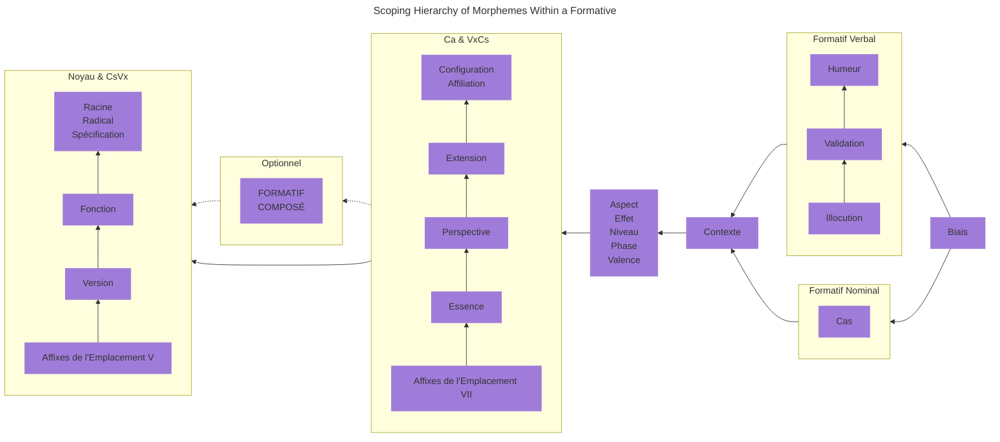

## 2.0 Morpho-Phonologie {#Sec2}

La morpho-phonologie définit la manière dont une langue utilise ses phonèmes (sons porteurs de sens) et caractéristiques phonologiques (par exemple : l'accent tonique, la gémination, le ton, etc.) pour générer les motifs composant des mots et pour appliquer des catégories morphologiques (par exemple : singulier _versus_ pluriel, temps verbal, etc.) à ces mots.

::: info Composantes de la Locution

Il y a trois types de mots en Nouvel Ithkuil : les **formatifs**, les **adjoints**, et les **référentiels**. Les formatifs constituent une classe de mots qui correspondent à la fois aux noms et aux verbes dans les langages naturels (Dans la [Sec. 2.4.2](02#Sec2_4_2) ci-dessous, nous verrons pourquoi combiner les noms et les verbes en une classe unique est adéquat dans la grammaire néo-ithkuilique). Les adjoints sont des mots « d'aide » qui s'associent à un formatif pour fournir des informations sémantiques supplémentatires concernant ledit formatif. Les référentiels sont un type de mots similaires aux pronoms dans les langages naturels, bien que, comme nous le verrons, ils soient plus dynamiques et exhaustifs dans leur utilisation que la collection habituelle de pronoms présente dans d'autres langues.

:::

::: info Typologie Grammaticale

Le Nouvel Ithkuil est principalement une langue agglutinative, et secondairement une langue synthétique. Cela signifie que la formation des radicaux, inflections et dérivations morpho-sémantiques, et la combinaison de ces éléments en mots porteurs de sens, se fait d'abord par la jointure d'une ou plusieurs affixes (dont des préfixes, suffixes et infixes) à une racine sémantique. De plus, ces affixes sont elles-mêmes hautement synthétiques, et combinent de nombreuses catégories morphologiques en une unique forme phonologique. Pour résumer, cela signifie que les mots en Nouvel Ithkuil sont formés en joignant plusieurs affixes à une racine fondamentale, chaque affixe pouvant contenir plusieurs éléments de sens.

:::

## 2.1 La Séquence Standard des Formes Vocaliques {#Sec2_1}

Durant notre examen de la structure des mots en Nouvel Ithkuil, nous verrons que celle-ci est déterminée par une série d'« emplacements », chacun d'eux pouvant accueillir une affixe. Nous verrons ensuite qu'une bonne partie des affixes utilisables dans ces emplacements s'appuient sur un motif récurrent de neuf voyelles, ou sur une matrice de valeurs dont un axe contient neuf formes vocaliques. Par conséquent, la langue emploie une séquence standard généralisée de neuf formes vocaliques en plusieurs séries, qui peut être utilisée pour remplir chacun des Emplacements. Cette séquence standard généralisée de voyelles facilite la mémorisation de la myriade d'affixes pour des personnes souhaitant réellement apprendre la langue.

Le tableau ci-dessous affiche les différentes séries de cette « Séquence Standard des Formes Vocaliques ». Les lecteurs pourront se référer à ce tableau durant l'examen des nombreux emplacements morphologiques utilisés pour la formation des mots en Nouvel Ithkuil. Malgré le nombre de formes vocaliques, la structure de la séquence est relativement systématique lorsqu'elle est examinée de près.

    <table>
        <caption>La Séquence Standard des Formes Vocaliques</caption>
        <thead>
            <tr>
                <th>Forme</th>
                <th>Série 1</th>
                <th>Série 2</th>
                <th>Série 3&#42;</th>
                <th>Série 4</th>
            </tr>
        </thead>
        <tbody>
            <tr>
                <th>1</th>
                <td>a</td>
                <td>ai</td>
                <td>ia / uä</td>
                <td>ao</td>
            </tr>
            <tr>
                <th>2</th>
                <td>ä</td>
                <td>au</td>
                <td>ie / uë</td>
                <td>aö</td>
            </tr>
            <tr>
                <th>3</th>
                <td>e</td>
                <td>ei</td>
                <td>io / üä</td>
                <td>eo</td>
            </tr>
            <tr>
                <th>4</th>
                <td>i</td>
                <td>eu</td>
                <td>iö / üë</td>
                <td>eö</td>
            </tr>
            <tr>
                <th>5</th>
                <td>ëi</td>
                <td>ëu</td>
                <td>eë</td>
                <td>oë</td>
            </tr>
            <tr>
                <th>6</th>
                <td>ö</td>
                <td>ou</td>
                <td>uö / öë</td>
                <td>öe</td>
            </tr>
            <tr>
                <th>7</th>
                <td>o</td>
                <td>oi</td>
                <td>uo / öä</td>
                <td>oe</td>
            </tr>
            <tr>
                <th>8</th>
                <td>ü</td>
                <td>iu</td>
                <td>ue / ië</td>
                <td>öa</td>
            </tr>
            <tr>
                <th>9</th>
                <td>u</td>
                <td>ui</td>
                <td>ua / iä</td>
                <td>oa</td>
            </tr>
        </tbody>
    </table>

\* Lorsqu'elles sont précédées par **y**-, les formes de la Série 3 commençant par -**i** deviennent leur forme alternative (par exemple : **yuä**, pas **yia**), alors que les formes de la Série 3 commençant par -**u** deviennent leur forme alternative lorsqu'elles sont précédées par **w**- (par exemple : **wiä**, pas **wua**).

## 2.2 Règles pour l'Insertion d'un Coup de Glotte dans une Forme Vocalique {#Sec2_2}

Durant notre examen de la structure des mots, nous verrons que certains des emplacements morpho-phonologiques la constituant demandent l'insertion d'un coup de glotte dans une forme vocalique **V**. Pour ce faire, suivez les règles suivantes :

1. Si **V** est une voyelle seule ou une diphtongue, le coup de glotte est placé après **V**. Par exemple : -**a** devient -**a’**, -**ai** devient -**ai’**.
2. Si **V** est une conjonction disyllabique, le coup de glotte est inséré entre les deux voyelles de **V**. Par exemple : -**ua** devient -**u’a**.
3. Lors de l'application de la Règle 1 ci-dessus, si l'insertion cause l'apparition d'une conjonction phonotactiquement interdite ou euphoniquement déplaisante, ou si le coup de glotte est inséré en fin de mot, alors une voyelle epenthétique doit être ajoutée comme suit :
	* Si **V** est une voyelle seule, elle est dupliquée à la suite du coup de glotte ; Par exemple : -**a** devient -**a’a**.
	* Si **V** est une diphtongue, le coup de glotte est inséré entre les deux voyelles de la diphtongue (en exception à la Règle 1 ci-dessus) ; Par exemple : -**ai** devient -**a’i** au lieu de l'habituel -**ai’**.
4. Le [Cas Exceptionnel dans Sec. 4.6](04#Sec4_6) expliquera comment, dans certaines circonstances, un coup de glotte dans l'affixe `Vc` de l'Emplacement IX peut être décalé sur un autre Emplacement du mot, dans le but d'en réduire le nombre de syllabes.

## 2.3 La Structure des Formatifs {#Sec2_3}

La structure morphologique d'un formatif peut être définie par la formule suivante :

::: center

<code>(Cc + Vv) + Cr + Vr + ( CsVx ... ) + Ca + ( VxCs ... ) + ( VnCn ) + Vc / Vk + [ACCENT]</code>

:::

Où, à l'exception de `Cr` et de `[ACCENT]`, chaque terme fait référence à une affixe composée soit d'une forme consonantique (représentées par **C** dans la formule), soit d'une forme vocalique (représentées par **V**), soit d'une combinaison des deux (par exemple : <code>CsVx</code> ou <code>VnCn</code>). Le terme `Cr` fait référence à la racine du mot elle-même, une forme consonantique constituée d'une à cinq consonnes. Comme le montrent les ensembles entre parenthèses, certains des termes de cette formule sont optionnels ; Ainsi, certains formatifs contiennent un minimum de cinq termes : <code>Cr + Vr + Ca + Vc / Vk + [ACCENT]</code>. Ces divers éléments morphologiques doivent apparaître dans un ordre donné, et peuvent donc être compris comme remplissant dix « emplacements » morphologiques. Ces Emplacements sont numérotés séquentiellement de I à X, comme illustré dans le tableau suivant.

<!-- @include: struct.md{1-156} -->

Les structures morphologiques et fonctions sémantiques spécifiques à chacun de ces emplacements seront abordées séparément dans des sections dédiées de ce document. Un aperçu préliminaire de chaque emplacement est déroulé ci-dessous.

::: tabs

@tab I

`Cc`

Cet emplacement peut être rempli par un coup de glotte **’**-, **h**-, ou une form biconsonantique commençant par **h**- (par exemple : **hw**-, **hr**-, **hm**-, etc.). Il indique si le formatif est indépendant (non composé), composé de Type 1 ou composé de Type 2. La composition de formatifs est abordée dans la [Sec. 10.1](10#Sec10_1). Il indique aussi si l'Emplacement II ci-dessous contient le « raccourci » des Emplacements IV et VI (permettant que ceux-ci soient élidés, raccourcissant le mot).

@tab II

`Vv`

Contient l'une des 32 formes vocaliques différentes indiquant le Radical et la Version du formatif. Chaque racine possède quatre radicaux associés ; Les radicaux sont abordés dans la [Sec. 2.4.3](02#Sec2_4_3). Chaque formatif possède deux Versions, PROCESSUELLE et COMPLÉTIVE, qui sont abordées dans la [Sec. 3.7](03#Sec3_7). Additionnellement, cet emplacement peut contenir un « raccourci » pour les Emplacements IV et VI (permettant que ceux-ci soient élidés, raccourcissant le mot). Dans certaines circonstances, cet emplacement fonctionne également comme un « raccourci » pour l'une de trois affixes pré-sélectionnées de l'Emplacement VII.

@tab III

`Cr`

C'est une forme consonantique composée d'une à cinq consonnes, indiquant la racine sémantique du formatif, abordée dans la [Sec. 2.4](02#Sec2_4).

@tab IV

`Vr`

Contient l'une des 32 formes vocaliques indiquant la Fonction, la Spécification et le Contexte du formatif. Il existe deux Fonctions : STATIVE et DYNAMIQUE, abordées dans la [Sec. 3.8](03#Sec3_8). Il existe quatre Spécifications : BASIQUE, CONTENTIELLE, CONSTITUTIVE et OBJECTIVE, abordées dans la [Sec. 2.4.4](02#Sec2_4_4). Il existe quatre Contextes : EXISTENTIEL, FONCTIONNEL, REPRESENTATIONNEL et AMALGAMATIF, abordés dans la [Sec. 3.9](03#Sec3_9).

@tab V

(`CsVx` ... )

Contient une ou plusieurs affixes descriptives de la forme « forme consonantique + forme vocalique » qui s'appliquent au radical seul (plutôt qu'au mot dans sont ensemble). Chaque affixe peut avoir trois types : circonstanciel, dérivationnel, ou limité. Plus de 400 affixes de ce type sont disponibles, et elles sont abordées dans le [Chapitre 7](07).

@tab VI

`Ca`

Une affixe consonantique conjonctive couvrant les cinq catégories suivantes : la Configuration, l'Affiliation, l'Extension, la Perspective et l'Essence. Ces catégories sont toutes abordées dans le [Chapitre 3](03). La formation du complexe affixal <code>Ca</code> lui-même est abordée dans la [Sec. 3.6](03#Sec3_6).

@tab VII

`VxCs`

Contient une ou plusieurs affixes descriptives de la forme « forme vocalique + forme consonantique » qui s'appliquent à la combinaison du radical et de ses catégories d'Emplacement VI <abbr>Ca</abbr> (plutôt qu'au radical seul). Mise à part l'inversion des formes consonantique et vocalique, ce sont les mêmes affixes qui sont utilisées pour l'Emplacement V.

@tab VIII

`VnCn`

Une affixe de type « forme vocalique + forme consonantique » qui exprime l'Humeur ou la Portée de Cas, ainsi que l'Aspect, la Phase, le Niveau ou l'Effet. L'explication de toutes ces catégories est le sujet du [Chapitre 5](05).

@tab IX

`Vc` / `Vf` / `Vk`

Une affixe vocalique qui, selon l'accentuation tonique indiquée par l'Emplacement X, exprime soit le Cas du formatif, soit le Format du formatif, soit une combinaison des catégories d'Illocution et de Validation. Le Cas est abordé dans le [Chapitre 4](04) ; Le Format dans la [Sec. 10.1](10#Sec10_1), et l'Illocution et la Validation dans le [Chaptire 6](06).

@tab X

`[ACCENT]`

L'accentuation syllabique du mot détermine le type de l'affixe exprimée dans l'Emplacement IX. Ceci est abordé dans la [Sec. 6.2.1](06#Sec6_2_1).

:::

### Hiérarchie des Domaines de Morphèmes au Sein d'un Formatif

La structure des Emplacements du formatif reflète plus ou moins la hiérarchie des morphèmes en son sein, c'est-à-dire l'ordre dans lequel l'information sémantique de chaque morphème est prise en compte et ajoutée à la morphologie construite à mesure que le mot est déroulé, en locution ou à l'écrit. Cet ordre hiérarchique est décrit ci-dessous :

Avant d'analyser individuellement et en détail chaque Emplacement de la formule morphologique précédente, il est important de comprendre le fonctionnement de la racine et du radical de chaque formatif. Il s'agit du sujet de la prochaine section ci-dessous.

## 2.4 Racine et Formation du Radical {#Sec2_4}

Tous les mots en <ins>Nouvel</ins> Ithkuil qui sont traduisibles en français par des noms ou des verbes sont fondés autour d'un radical, qui dérive à son tour d'une racine sémantiquement abstraite. Ce procédé est expliqué dans les sections suivantes.

<!-- @include: struct.md{157-312} -->

### 2.4.1 La Racine {#Sec2_4_1}

La racine forme la base sémantique dont dérivent les radicaux nominaux/verbaux proprement dits. La racine consiste en une forme consonantique, `Cr`, qui occupe l'Emplacement III dans la formule morphologique donnée plus haut. Elle peut contenir entre une et cinq consonnes (par exemple : -**k**-, -**st**-, -**ntr**-, -**pstw**-, -**rmzgl**-). Les contraintes phonotactiques (voir [Sec. 1.5](01#Sec1_5)) de la langue autorisent plus de 33 000 racines potentielles.

La racine est l'unité sémantique fondamentale. Par exemple, la racine -**DN**- a pour référent sémantique « NOM/DÉSIGNATION/APPELLATION ». Les radicaux fonctionnels (ou simplement radicaux) sont générés à partir de la racine grâce à l'instanciation de l'affixe vocalique `Vv`- à l'Emplacement II, comme décrit plus bas dans la Sec. 2.3.4. Cependant, avant d'aborder les Radicaux, il est d'abord nécessaire d'appréhender la notion de « formatif », afin que les lecteur.ice.s comprennent pourquoi tout radical fonctionne à la fois comme nom et verbe, et peut avoir un sens nominal et un sens verbal.

### 2.4.2 La Notion de « Formatif » {#Sec2_4_2}

Les composantes grammaticales de la locution connues dans d'autres langues comme le nom et le verbe sont combinées en Nouvel Ithkuil en une seule composante locutive appelée formatif. Tous les formatifs, sans exception, peuvent avoir fonction de nom et de verbe, et la décision d'interpréter un formatif comme un nom ou comme un verbe est déterminée par l'analyse de sa structure morpho-phonologique et de sa relation morpho-syntaxique avec le reste de la phrase. Par conséquent, il n'existe pas de formatifs référant uniquement à des noms ou uniquement à des verbes comme dans les langues occidentales. Ainsi, par exemple, le premier radical de la racine -**DN**- mentionnée précédemment signifie à la fois « un nom » et « nommer », et aucun de ces sens n'est considéré comme plus intrinsèque ou fondamental, ou comme découlant de l'autre. Une telle prévalence du sens nominal sur le sens verbal (ou vice-versa) se retrouve seulement lors de la traduction vers le français ou d'autres langues occidentales, dans lesquelles ces contraintes d'opposition lexicales entre noms et verbes sont inhérentes.

La raison pour laquelle noms et verbes peuvent fonctionner comme des dérivés morphologiques d'une unique composante locutive est que la morpho-sémantique néo-ithkuilique ne considère pas les noms et les verbes comme cognitivement distincts les uns des autres, mais plutôt comme des manifestations complémentaires d'une idée existant dans un _continuum_ sémantique sous-jacent commun dont les composants sont l'espace et le temps. À la manière des sciences physiques, le _continuum_ holistique contenant ces deux composants peut être imaginé comme un espace-temps. C'est dans ce _continuum_ d'espace-temps que le Nouvel Ithkuil instancie des idées sémantiques en racines lexicales, donnant naissance à la composante locutive appelée formatif. Le.a locuteur.rice peut ensuite choisir soit de « réifier » _spatialement_ ce formatif en un objet ou une entité (c-à-d un nom), soit de l'« activiser » _temporellement_ en une action, un événement, ou un état (c-à-d un verbe). Ces procédés complémentaires peuvent être représentés comme suit :

 {.inverted}

### 2.4.3 Les Radicaux {#Sec2_4_3}

Chaque racine possède trois radicaux, indiqués par la forme vocalique `Vv` dans l'Emplacement II de la formule morphologique de la [Sec. 2.3](#Sec2_3) ci-dessus. C'est au niveau du radical qu'une racine devient un mot à part entière avec son sens propre. Par exemple, le premier radical de notre racine -**DN**- serait -**adn**-, signifiant « (être) un nom [et l'entité nommée] ; être [quelque chose/quelqu'un de] nommé.e/appelé.e d'une certaine manière ». Le second radical ce cette racine serait -**edn**-, signifiant « (être) une désignation ou référence [et l'entité ainsi désignée] ; faire référence [à une entité]/être désigné.e d'une certaine manière », et le troisième radical serait -**udn**-, signifiant «(être) une appellation [et l'entité la portant] ; porter/donner une certaine appellation ».

En plus de ces trois radicaux indiqués par les voyelles -**a**-, -**e**- et -**u**- dans l'Emplacement II, il existe une quatrième forme indiquée par la voyelle -**o**-, appelée « Radical Zéro ». Cette forme spécialisée du radical représente le sens général conceptuel « pré-radical » de la racine brute, indépendemment de chacun des radicaux, le sens étant déterminé de façon pragmatique à partir de la racine elle-même. Ainsi, pour la racine -**DN**-, le Radical Zéro -**odn**- serait une amalgamation des sens de ses trois radicaux, donc « (être) un nom/une référence/une appellation [et l'entité nommée/désignée/portant l'appellation] ». Ceci permet au/à la locuteur.rice d'utiliser le radical pour induire une ambiguïté sémantique volontaire lorsqu'iel ne souhaite pas faire la distinction entre, disons, un humain adulte et un enfant humain.

### 2.4.4 La Spécification {#Sec2_4_4}

Afin de distinguer davantage l'idée sémantique fondamentale d'un mot, il existe une catégorie morphologique supplémentaire appelée la Spécification. Chacun des trois radicaux, ainsi le le quatrième « Radical Zéro », possède quatre Spécifications. Ces Spécifications servent à indiquer comment le radical doit être sémantiquement interprété dans le contexte du reste de la phrase. La meilleure façon de l'expliquer est de décrire l'utilité de chaque Spécification individuellement ci-dessous, en donnant des exemples. Les quatre Spécifications sont BASIQUE, CONTENTIELLE, CONSTITUTIVE et OBJECTIVE.

::: tabs

@tab BSC

<dl>
    <dt>BASIQUE</dt>
	<dd>Une instance holistique du radical, précédant l'application de l'une des autres Spécifications,
		englobant essentiellement les sens des spécifications <abbr>CTE</abbr> et <abbr>CSV</abbr> ci-dessous. Pour des racines représentant
		des notions naturellement « activisées », temporellement instables, dynamiques ou psychologiquement assimilables à des verbes,
		un formatif nominal BASIQUE signifierait « une instance/occurence de X », tandis qu'un formatif verbal BASIQUE signifierait
		« (une instance/occurence de) X se produit ». Pour des radicaux représentant des notions naturellement « réifiées », 
		temporellement stables, statiques ou psychologiquement assimilables à des noms, un formatif nominal BASIQUE signifierait
		« (la présence d') un X » ou, pour une entité indénombrable, « une quantité de X (spécifiée ou non) », tandis qu'un formatif
		verbal BASIQUE induirait une interprétation STATIVE signifiant « (un) X est présent / être (un) X » ; D'autres Spécifications
		permettraient de développer davantage ce sens.</dd>
</dl>

@tab CTE

<dl>
    <dt>CONTENTIELLE</dt>
	<dd>Cette spécification est complémentaire à la spécification <abbr>CSV</abbr> ci-dessous. Elle se rapporte au « contenu »,
		physique ou non physique, à l'essence, à la fonction intrinsèque ou à la forme idéalisée/abstraite/platonique du concept en question,
		par opposition à sa simple forme physique, par exemple : <em>le contenu d'une œuvre d'art</em> [ce qu'elle représente, son sujet] ; 
		<em>l'eau d'une rivière</em> [sans égard pour son lit ou son cours] ; <em>le contenu communiqué par un message</em> [sans égard 
		pour le moyen ou le canal de communication utilisé] ; <em>une pièce en tant qu'espace habitable/fonctionnel, avec un usage établi
		par convention sociale ou discernable par son design, son ammeublement, sa décoration, etc.</em></dd>
</dl>

@tab CSV

<dl>
    <dt>CONSTITUTIVE</dt>
	<dd>Cette Spécification se rapporte à la forme (physique ou non physique) constituant l'expression, la délimitation
		ou la réalisation d'un.e entité/état/action, par opposition à son contenu fonctionnel/significatif, c'est-à-dire 
		« ce qui constitue X ». Par exemple : <em>une œuvre d'art</em> [en tant que toile peinte, marbre sulpté, etc., sans
		égard pour le sujet représenté par l'image ou la statue] ; <em>le lit d'une rivière</em> ; <em>la forme/le canal 
		(écrit, parlé, enregistré, etc.) d'un message</em> [sans égard pour ce qui est communiqué] ; <em>quelque-chose en
		fer</em> [l'attention étant portée sur le matériau/la substance le.a constituant, sans égard pour sa forme] ; 
		<em>une pièce en tant que volume spatial défini établi par des murs et un plafond conjoints</em> [sans égard pour son
		usage, ses dimensions, son agencement, son design, son ammeublement ou sa décoration].</dd>
</dl>

@tab OBJ

<dl>
    <dt>OBJECTIVE</dt>
	<dd>Cette Spécification se rapporte au plus adapté à la sémantique du radical en question parmi les sens suivants :
		(1) l'outil/l'instrument/le moyen tangible par lequel un.e action/état/événement se produit, ou si non applicable,
		alors (2) l'objet/l'entité tiers.ce associé.e à une interaction entre deux parties (par exemple : l'objet étant
		donné dans une interaction dative), ou si non applicable, alors (3) l'objet/le produit/la situation tangible 
		résultant d'un.e état/action/événement, ou si non applicable, alors (4) le patient ou expérimentateur sémantique 
		d'un.e état/action/événement. Par exemple : <em>l'instrument de musique dont on joue pendant un concert</em> ; 
		<em>le livre contenant l'histoire en train d'être lue</em> ; <em>un objet étant donné à quelqu'un</em> ; <em>Ce
		qu'un artiste crée (c-à-d une œuvre d'art)</em> ; <em>l'entité/la personne/l'institution constituant l'objet/la source
		des croyances de quelqu'un</em> ; <em>la mesure résultant d'un acte de mesurer</em>.</dd>
</dl>

:::

La catégorie de la Spécification est indiquée par l'affixe vocalique `Vr` dans l'Emplacement IV du formatif (comme vu dans la [Sec. 2.3](#Sec2_3)). Les affixes par défaut pour les quatre Spécifications sont <abbr>BSC</abbr> = -**a**-, <abbr>CTE</abbr> = -**ä**-, <abbr>CSV</abbr> = -**e**- et <abbr>OBJ</abbr> = -**i**-.

Ainsi, pour illustrer le fonctionnement de la Spécification en conjounction avec les trois radicaux d'une racine, nous pouvons décomposer les significations des trois radicaux de notre exemple de racine -**DN**- pour chacune des quatre Spécifications, comme suit :

::: tabs

@tab -DN-

-**DN**- <tooltip label="NAME / DESIGNATION / LABEL">NOM/DÉSIGNATION/APPELLATION</tooltip>

    
Radical 1

    

        <dl>
            <dt><abbr>BSC</abbr>: -adna-</dt>
            <dd>(être) un nom [et l'entité nommée] ; être nommé.e/appelé.e d'une certaine manière</dd>
        </dl>
        <dl>
            <dt><abbr>CTE</abbr>: -adnä-</dt>
            <dd>(être) une entité ayant un nom</dd>
        </dl>
        <dl>
            <dt><abbr>CSV</abbr>: -adne-</dt>
            <dd>(avoir) un nom ; porter un nom</dd>
        </dl>
        <dl>
            <dt><abbr>OBJ</abbr>: -adni-</dt>
            <dd>(être) le nom porté par une entité</dd>
        </dl>
    

    
Radical 2

    

        <dl>
            <dt><abbr>BSC</abbr>: -edna-</dt>
			<dd>(être) une désignation ou référence [et l'entité ainsi désignée] ; faire référence à [une entité] d'une certaine manière</dd>
        </dl>
        <dl>
            <dt><abbr>CTE</abbr>: -ednä-</dt>
            <dd>(être) une entité désignée ou référée d'une certaine manière</dd>
        </dl>
        <dl>
            <dt><abbr>CSV</abbr>: -edne-</dt>
            <dd>(faire l'objet d') une désignation ou référence</dd>
        </dl>
        <dl>
            <dt><abbr>OBJ</abbr>: -edni-</dt>
            <dd>(être) la désignation d'une entité ou la référence à cette entité</dd>
        </dl>
    

    
Radical 3

    

        <dl>
            <dt><abbr>BSC</abbr>: -udna-</dt>
			<dd>(être) une appellation [et l'entité la portant] ; donner une appellation</dd>
        </dl>
        <dl>
            <dt><abbr>CTE</abbr>: -udnä-</dt>
            <dd>(être) une entité portant une appellation</dd>
        </dl>
        <dl>
            <dt><abbr>CSV</abbr>: -udne-</dt>
            <dd>(porter) une appellation</dd>
        </dl>
        <dl>
            <dt><abbr>OBJ</abbr>: -udni-</dt>
            <dd>(être) l'appellation portée par une entité</dd>
        </dl>
    

Les formes du « Radical Zéro » seraient -**odna**-, -**odnä**-, -**odne**- et -**odni**-.

@tab -LK-

-**LK**- <tooltip label="MUSIC/ PLAY MUSIC / COMPOSE MUSIC">MUSIQUE/JOUER DE LA MUSIQUE/COMPOSER DE LA MUSIQUE</tooltip>

    
Radical 1

    

        <dl>
            <dt><abbr>BSC</abbr>: -alka-</dt>
            <dd>(être) l'état/l'action de diffusion de musique (qu'elle soit enregistrée ou en direct)</dd>
        </dl>
        <dl>
            <dt><abbr>CTE</abbr>: -alkä-</dt>
            <dd>(être) l'état qu'il y ait de la musique (à l'écoute)</dd>
        </dl>
        <dl>
            <dt><abbr>CSV</abbr>: -alke-</dt>
            <dd>(être) l'état/l'action d'entendre/d'écouter de la musique</dd>
        </dl>
        <dl>
            <dt><abbr>OBJ</abbr>: -alki-</dt>
            <dd>(être) le son de la musique, la musique (ou le morceau) spécifique étant écouté</dd>
        </dl>
    

    
Radical 2

    

        <dl>
            <dt><abbr>BSC</abbr>: -elka-</dt>
            <dd>(être) l'état/l'action de jouer/faire de la musique (c-à-d avec un instrument)</dd>
        </dl>
        <dl>
            <dt><abbr>CTE</abbr>: -elkä-</dt>
            <dd>(être) l'état qu'il y ait de la musique produite par le jeu d'un instrument de musique</dd>
        </dl>
        <dl>
            <dt><abbr>CSV</abbr>: -elke-</dt>
            <dd>(être) l'action de jouer de la musique avec un instrument ; (être en train de) jouer d'un instrument de musique</dd>
        </dl>
        <dl>
            <dt><abbr>OBJ</abbr>: -elki-</dt>
            <dd>(être) un certain instrument de musique (utilisé pour jouer de la musique)</dd>
        </dl>
    

    
Radical 3

    

        <dl>
            <dt><abbr>BSC</abbr>: -ulka-</dt>
            <dd>(être) l'état/l'action de composer un passage de musique, une phrase musicale, une mélodie, un morceau ;
				composer une mélodie/un morceau/un passage de musique ou une phrase musicale</dd>
        </dl>
        <dl>
            <dt><abbr>CTE</abbr>: -ulkä-</dt>
            <dd>(être) l'état que quelqu'un ait une phrase musicale/un passage de musique/un morceau/une mélodie
				en tête ; être une mélodie/un morceau/une phrase musicale/un passage de musique dans l'esprit de
				quelqu'un qui compose</dd>
        </dl>
        <dl>
            <dt><abbr>CSV</abbr>: -ulke-</dt>
            <dd>(être l'état/l'action de composer de la musique ; composer (un passage/un morceau) de (la) musique</dd>
        </dl>
        <dl>
            <dt><abbr>OBJ</abbr>: -ulki-</dt>
            <dd>(être) un.e certain.e mélodie/morceau/phrase musicale/passage en composition ou en tête</dd>
        </dl>
    

Les formes du « Radical Zéro » seraient -**olka**-, -**olkä**-, -**olke**- et -**olki**-.

:::

### 2.4.5 Le Lexique {#Sec2_4_5}

Les Racines et Radicaux de la langue (ainsi que leurs Spécifications) sont listés dans un document séparé, [le Lexique](http://ithkuil.net/newithkuil_lexicon.pdf).

::: tip

Veuillez consulter [la base de données numérisée](14) comme référence principale, car elle propose des rectifications et informations supplémentaires concernant les erreurs décelées dans le document originel.

:::

<PDF url="../assets/newithkuil_lexicon.pdf" />

::: info Note du/de la Traducteur.rice

Le Lexique et la base de données numérisée sont laissés en anglais originel

:::

## 2.5 Les Adjoints {#Sec2_5}

En plus des formatifs, une autre composante de la locution en Nouvel Ithkuil est l'**adjoint**. Les adjoints sont appelés ainsi car ils opèrent en conjonction avec les formatifs adjacents afin de fournir davantage d'informations grammaticales sur le formatif, un peu à la manière des auxiliaires en anglais (par exemple : « _may_, _will_, _would_, _do_, _have_ ») ou des déterminants en français (par exemple : « le, un, ce, celui »). Les adjoints sont constitués d'une ou plusieurs affixes consonantiques et/ou vocaliques, combinées de manière agglutinative. Il existe différents types d'adjoints, abordés en détail dans le [Chapitre 8](08).

## 2.6 Les Référentiels {#Sec2_6}

Les **référentiels** sont des mots opérant un peu comme les pronoms dans les langages naturels, servant à identifier le référent personnel associé à un formatif. La structure et le fonctionnement des référentiels, cependant, sont plus complexes et dynamiques que ceux des pronoms des langages naturels. Les référentiels seront abordés dans le [Chapitre 9](09).

## 2.7 Une Morphologie Auto-Ségrégative {#Sec2_7}

La langue emploie un système d'accentuation tonique afin d'interpréter les frontières entre les mots. Les détails de ce système d'accentuation tonique sont donnés ci-dessous :

1. Toutes les syllabes non-accentuées précédant la syllabe accentuée dans un mot prennent un accent neutre (ton MEDIAN). À partir de la syllabe accentuée, le reste du mot doit prendre un unique contour tonique non-MEDIAN, comme décrit dans la Règle 2 ci-dessous.

2. À partir de la syllabe accentuée, un mot peut prendre N'IMPORTE LEQUEL des contours toniques suivants au choix du/de la locuteur.rice : DESCENDANT, HAUT, ASCENDANT-DESCENDANT, DESCENDANT-ASCENDANT.

	* Si la phrase porte l'Illocution VERIFICATIVE (l'équivalent d'une question fermée), le.a locuteur.rice peut optionnellement employer un ton ASCENDANT sur le dernier mot de la clause interrogative.

	* Pour les clauses utilisant un Registre non-NARRATIF, les premier et dernier mots de la clause du registre peuvent optionnellement être marqués avec un ton BAS (auquel cas il n'est pas nécessaire d'utiliser l'adjoint de fin de registre).

En général, le choix du ton peut s'accorder avec les facilités naturelles du/de la locuteur.rice, liées à sa langue natale, tant qu'il respecte ces règles.

3. Une fois que le choix du ton de la syllabe accentuée a été fait, celui-ci doit être prononcé continûment jusqu'à la fon du mot sans changement de contour (c-à-d que chaque mot ne pourra avoir qu'un seul contour tonique non-MEDIAN).

4. Si un mot est accentué en début de mot (c-à-d qu'il ne commence pas avec un ton MEDIAN neutre) ou est monosyllabique, et qu'il ne se trouve pas juste après une respiration, alors il doit prendre un contour dont le ton initial est différent du ton final du mot précédent, afin d'éviter que deux tons identique ne soient juxtaposés à la frontière entre deux mots. En pratique, cela signifie que les règles suivantes s'appliquent lorsque deux mots adjacents ne sont pas séparés par une respiration et que le second mot est accentué en début de mot ou est monosyllabique :

	* Lorsqu'il est précédé par un mot portant un ton DESCENDANT, ASCENDANT-DESCENDANT ou BAS, un mot monosyllabique ou accentué en début de mot doit prendre un ton DESCENDANT, DESCENDANT-ASCENDANT ou HAUT.
	* Lorsqu'il est précédé par un mot portant un ton HAUT, ASCENDANT ou DESCENDANT-ASCENDANT, un mot monosyllabique ou accentué en début de mot doit prendre un ton ASCENDANT, ASCENDANT-DESCENDANT ou BAS.

5. Dans des situations inhabituelles (par exemple : en chanson) où l'accent tonique est indisponible ou indésirable en tant que moyen d'interpréter les frontières entre les mots, et que le placement de pauses entre les mots est irréalisable, alors un **adjoint de séparation** spécial de la forme **’V’** peut être placé avant tout mot devant être interprété comme tel, avec **’V’** représentant une unique voyelle entre deux coups de glotte, la voyelle en question déterminant l'accentuation tonique du mot suivant l'adjoint comme suit :

    * **ʼaʼ** indique que le mot suivant est monosyllabique
    * **ʼeʼ** indique que le mot suivant est accentué sur la dernière syllabe
    * **ʼoʼ** indique que le mot suivant est accentué sur la pénultième syllabe
    * **ʼuʼ** indique que le mot suivant est accentué sur l'antépénultième syllabe

Voir la [Sec. 11.8](11#Sec11_8) pour la manière d'indiquer une jonction entre deux phrases.
